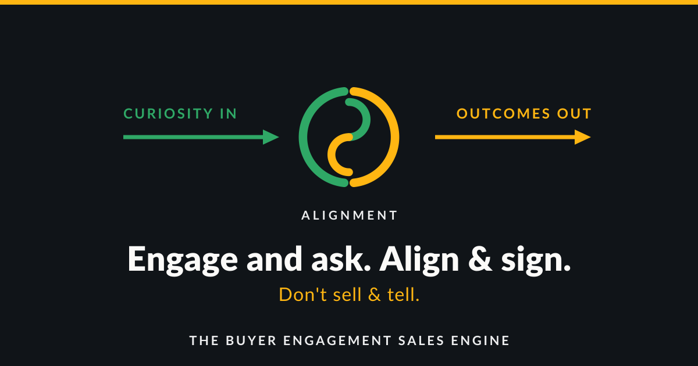



# The Buyer Engagement Sales Engine

**Engage and ask. Align & sign.**
*Don't sell & tell.*

Curiosity In. Alignment. Outcomes Out.

---

## What this is

This repo is the **Free library** for **The Buyer Engagement Sales Engine** -- a **sales-process operating system in a folder**.

The full product runs the **Buyer Engagement Process** on **your** AI (Claude or Grok), on **your** machine: durable folders, memory on disk, drafts only until **you** say send. That's the Golden Wedge -- AI without a real process on disk finally gets one.

Here you get the **words and ideas** (terms, preview entries, worksheet fronts, Fit Chat). A library you can browse and use **while you sell** -- learn as you go, not a homework course before you start. The **engine** that runs deals (skills, Boot, send gate, live memory) stays in the paid package when open.

Not another tip list. Not a cloud that owns your pipeline. Method vocabulary today; process OS when you're ready.

---


## Install as plugin

Claude Code and Grok Build can load this Free surface as a plugin.

- Plugin id: `buyer-engagement-sales-engine-free`
- Version: **1.0.10-free.4**
- Free only -- paid engine not included

See **[PLUGINS.md](PLUGINS.md)** for **click-by-click** install (Claude Path A/B + Grok Build), skills table, and version table.

## Discovery words (GitHub Topics)

Suggested Topics for this repo (Settings -> Topics): `sales`, `sales-process`, `buyer-engagement`, `sales-methodology`, `sales-os`, `local-first`, `claude`, `claude-code`, `claude-plugin`, `grok`, `ai-sales`, `fit-chat`.

About blurb: Free library for a sales-process OS in a folder -- Buyer Engagement on your Claude/Grok. Learn as you go. Not an AI SDR.

## What is in here (Free surface)

```
library/entries/     preview entries (teasers -- paid depth held back)
library/terms/       term cards
library/worksheets/  worksheet fronts
library/paths/       guided path
library/GLOSSARY.md
brand/               logos and hero
LICENSE              MIT
HOW_WE_HELP.md       Fit orientation (concepts only)
FIT_CHAT_PASTE.txt   paste for a decide-to-buy chat
```

Counts match the Free pack (same entry files as Free; **not** the paid "Understanding it" / "Put it into practice" depth).

Gate line in entries: FREE PREVIEW ENDS HERE.

---

## Licence (MIT)

MIT for this Free library and brand assets. Copyright The Buyer Engagement Sales Engine, 2026.
Keep the copyright notice. This does **not** licence the paid engine (`_system`, skills, operating loop).

Maker owns the product. You own your business data and customizations. See ownership notes in the paid package: `_system/offer/OWNERSHIP_AND_CUSTOMIZE.md`.

---

## What is not in here

- The **engine** -- folder + skills that run buyer engagement on your machine (paid when open)
- An **AI SDR** that auto-sends or burns domains
- Another **destination login** / empty checklist CRM
- **Invented proof**, fake ROI, or pitch-and-pray scripts
- A homework course before you can work

Private beta for the engine is open via Stripe. Ladder: Free -> Run -> Automate (Team is proposal). See [UPGRADE.md](UPGRADE.md).

---

## Upgrade to Run

Ready for the engine (Boot, skills, send gate on your machine)?

See **[UPGRADE.md](UPGRADE.md)** for Stripe Payment Links:

- **Founding $199 first year** (through 2026-09-18): https://buy.stripe.com/3cIbIVa3k5az2gv7CqdQQ00

- **Run $499/yr**: https://buy.stripe.com/aFa6oBejAeL9bR52i6dQQ01

After pay, you get the Run zip by email (manual fulfill). Free library stays free.

Fit Chat: paste `FIT_CHAT_PASTE.txt` into Claude/Grok with `HOW_WE_HELP.md`. LinkedIn: Greg van der Linde.


---


## Who it is for

- Owner-operators without a repeatable process
- Experienced sellers who want a method without another empty checklist login
- Small sales leaders with a forecast that is a guess
- Practitioners already in Claude or Grok who want structure

Not for: auto-send seekers, invented-proof seekers, pure transactional spam.

---

## Ethos

Engage and ask. Align & sign.  
Don't sell & tell.