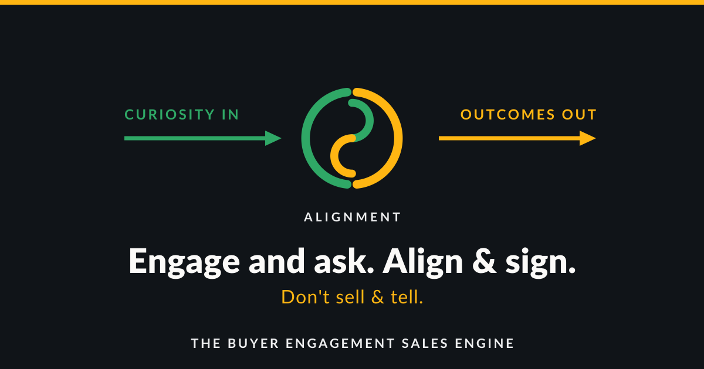

# The Buyer Engagement Sales Engine

### Curiosity In. Alignment. Outcomes Out.

> The deal is usually lost before the meeting — in the preparation nobody had time to do.

## What it is

A sales process that runs on your own machine and does the preparation a complex deal needs. It learns your business from your own files — what you sell, what only you do, and the things that must never leave the building. It researches a company and maps who signs, who can veto, and who has to live with it. It builds every message from what is true, aimed at a named person, with the reasoning attached. Nothing sends without your yes.

**This repository is the free library** — the method written out so you can read it and use it while you sell. The full engine that runs your deals is the paid upgrade.

## Know your business. Know yourself. Know your customer.

The engine is built on three kinds of knowing, and it aligns them to each buyer's profile:

- **Know your business** — your truth, built from your own files: what you sell, your edge, your proof, and what must never leave the building.
- **Know yourself** — your own way of selling, so you play to your strengths instead of copying someone else's.
- **Know your customer** — each account and every person in it researched, and mapped to who decides and what they care about.

Every step aligns to your buyer's profile, keeps what's private private, and shows the reason for each move — so you learn as you go from the library.

## What we are not

- **Not** a spam sales engine.
- **Not** for transactional, one-call sales.
- **Not** volume outreach, auto-send, or invented proof — it refuses those by design.

Built for **complex sales**: more than one decision maker, and a longer sales cycle.

## Whether you sell for a living or own the business

- **If you sell for a living** — this adds credibility, insight and discipline to how you already work.
- **If you own the business** — you don't have to become a salesperson. You already know the product or service. You are guided at every step, and you can tap into the learning library for the reasons why — or simply let the engine guide you.

## Who it is for

- **Founders and inventors** selling something new to organisations.
- **Consultants and fractional leaders** who have to win new clients.
- **Owners** whose deals need several people to agree.
- **The salespeople who carry the deals:** the one who wants an edge on a complex account; the first hire taking over a desk — starting with everything the owner knows, not a blank page; and the account executive preparing a multi-person deal on their own (where their company allows it).

## Free library vs. the full engine

| What you get | Free library (this repo) | The full engine |
|---|:---:|:---:|
| The method — entries, terms, worksheet fronts, a guided path | ✅ read & use | ✅ built in |
| Runs inside your own Claude or Grok | ✅ | ✅ |
| Learn the sale as you go, with the reason for each step | ✅ | ✅ |
| Builds your seller truth from your own files | ❌ | ✅ |
| Researches each account and every person in it | ❌ you do it | ✅ done for you |
| Aligns each account to your buyer's profile | ❌ | ✅ |
| Keeps what's private private — a never-say check on every draft | ❌ you watch it | ✅ checked for you |
| Drafts every message in your voice, ready where you send | ❌ | ✅ never sends |
| Remembers per-person rules across days | ❌ | ✅ |
| Marks what isn't known instead of guessing | ❌ | ✅ |
| A dashboard to track your accounts and progress | ❌ | ✅ |
| A handover ready for your first salesperson | ❌ | ✅ |
| Price | **Free** | **CA$40 — intro offer** |

## How the free library works

You get the **words and ideas** — terms, preview entries, worksheet fronts, and a guided path — to browse and use **while you sell**. Learn as you go, not a homework course before you start. The engine that runs deals (skills, Boot, the send gate, live memory) is the paid upgrade.

Curiosity before pitch. Engage and ask. Human approval before anything leaves. Local-first. Learn while working.

## Upgrade to the full engine

Ready for the engine that does the preparation for you — on your own machine, nothing sent without your yes?

**CA$40 — intro offer.** One-time. Automatic download and a receipt the moment you check out; you get updates as it improves.

**→ [Get the engine](https://buyerengagementsalesengine.lemonsqueezy.com/checkout/buy/2fb92e7d-a0b7-4722-bd8b-6cf5711ca34e)** · details in **[UPGRADE.md](UPGRADE.md)**

The free library stays free.

## Install as a plugin

Claude Code and Grok Build can load this free library as a plugin. Click-by-click steps, the skills table, and the version table are in **[PLUGINS.md](PLUGINS.md)**.

## License

MIT — see [LICENSE](LICENSE).

---

*Truth first, seats second, conversations third. It keeps the discipline of sales true — and brings the art of sales and the business of sales together.*
